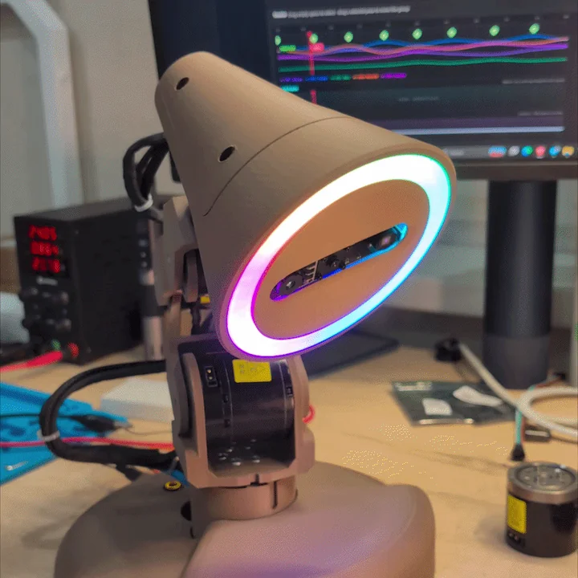
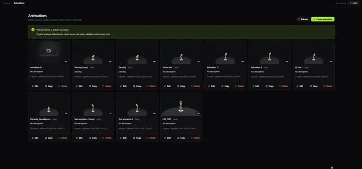
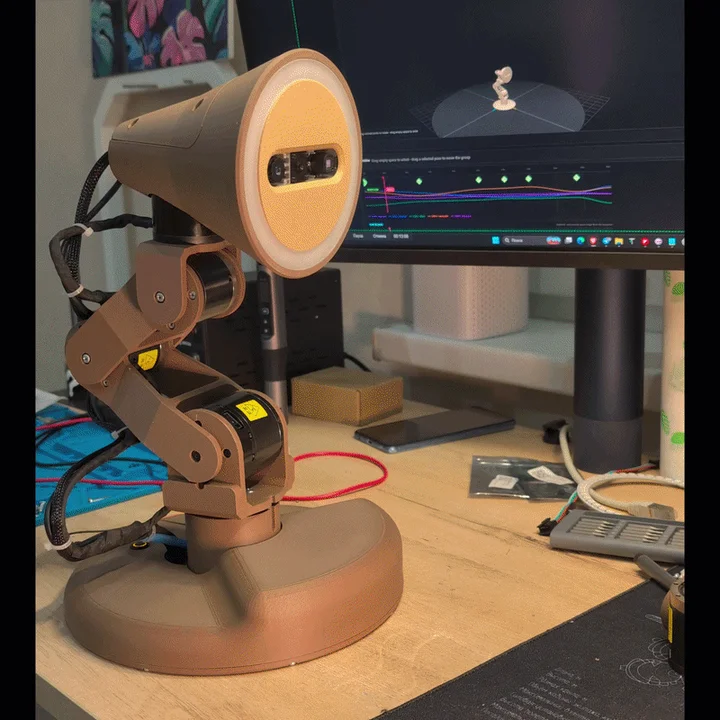

# Watti

### A desk lamp that's learning to be more than a lamp

  
  
  
  
  
  

> [!IMPORTANT]
> Watti is still a prototype. The code isn't public yet; this repository is where I document the project until it is ready to open.

Watti started with a simple question: what if a desk lamp could notice what you're doing and help?

Today it can play light scenes made in Watti Studio. I'm now adding a depth camera; movement comes next. The longer-term goal is a lamp that can light the part of the desk you're working on, scan objects, react to its surroundings, and act as a small desktop assistant. It will still work as a lamp too. That part seemed worth keeping.

  

The project has two parts:

- **Watti** is the lamp itself: five motors, an RGB-D camera, and a ring of 45 LEDs;
- **Watti Studio** is the visual editor used to create scenes and send them to the lamp.

You won't need to write firmware to make a light scene. Build it in the editor, preview it, and send it to Watti.

Technical details: [Architecture](docs/ARCHITECTURE.md) · [Hardware](docs/HARDWARE.md)

  

## Roadmap

This is the order I'm working in. It may change as the prototype finds new ways to disagree with me.

1. Build the lamp prototype. ✅ ([video](https://www.youtube.com/shorts/RNfTPX3ZyCU))
2. Build the Watti Studio prototype. ✅ ([video](https://www.youtube.com/shorts/8JjrI_3LMm4))
3. Add lighting control. ✅ ([video](https://www.youtube.com/shorts/xLPSfVRswmg))
4. Integrate and configure the depth camera. ([video](https://youtube.com/shorts/2RgtMTqhEyE))✅
5. Teach Watti to move and jump. 🛠️ ([video](https://youtube.com/shorts/_YJVPZ9At0A?si=_c9Ts3NbEwyz8PON), [video](https://www.instagram.com/p/DdH2O7eI5tQ/))
6. Add procedural animation: track hands and keep the active work area lit. ([video](https://www.instagram.com/p/Dc3e0IpIBvs/))✅
7. Run a public test of Watti Studio. ([open Watti Studio](https://studio.watti.dev/))🛠️
8. **Crush the letter “I.”**
9. Release the source code.

Step eight is a real milestone. Context will only make it slightly less strange.

### After the source release

- Scan the desk, the room, and individual objects in 3D.
- Add an agent mode with MCP, voice control, and autonomous behavior.
- Try ideas suggested by people using Watti.

## Watti Studio

The editor is where scenes are put together: poses and light settings go on a timeline, the result can be previewed in 3D, and the finished scene is sent to the lamp.
Or, you can see a more complete demonstration of the work [here](https://www.youtube.com/watch?v=fHa_zdbjfYk)

  

## The lamp

The physical prototype has five motorized joints, a depth camera in its head, and a ring of 45 LEDs. Light scenes already run on the lamp; full movement and camera-driven behavior are still being tested. For now, Watti is better at lighting the desk than wandering around it.

  

## How a scene gets to Watti

Watti Studio sends the whole scene rather than steering the lamp one frame at a time. Watti checks the file, stores it, and plays it locally on the Raspberry Pi. Motion and light share the same 25 Hz timeline, so playback doesn't depend on keeping the browser connected.

## Things I want to try

These aren't finished features. They're the reasons I'm building the project.

- keep the active work area lit while both hands are busy;
- use light for timers and quiet notifications;
- show computer, build, or smart-home status without another screen;
- react to music, games, and streams;
- scan small objects and the space around the lamp;
- experiment with a physical desktop assistant that can see and move.

## Source code

I plan to publish Watti Studio, the software running on Watti, the communication protocol, and example scenes. Hardware files should follow with the electrical diagrams, bill of materials, and printable parts.

I'm not attaching a license before I know exactly what will be included in the first release. Until then, this repository is a project preview, not an open-source release.

## Questions and ideas

Have a technical question or an idea for Watti? Open an issue. I'll check in and reply when I can while the project is still in development.
