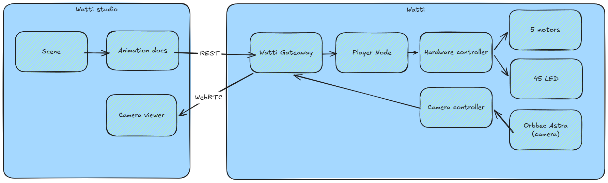

# Architecture

The short version: Watti Studio creates a scene, and Watti plays it. The lamp doesn't need a permanent connection to the editor once playback has started.

  

## Watti Studio

Watti Studio is a browser-based editor for motion and light. It has a five-axis model of the lamp, a timeline for poses and LED settings, inverse kinematics, a Look At mode, and a virtual preview. It can also show the RGB and depth streams from the camera.

The editor works offline. A physical lamp is useful, obviously, but it isn't required to build or preview a scene.

## Sending a scene

The editor packages the full scene before sending it. That scene includes the poses for all five axes, transition timing, light settings, effects, and loop behavior.

Watti checks the scene, saves it, and plays it locally. The computer can disconnect after playback begins; there is no stream of browser commands that has to arrive on every frame.

## On the lamp

A Raspberry Pi 5 runs ROS 2 and connects the parts that matter during playback:

- motor control;
- the LED ring;
- scene storage and playback;
- the RGB-D camera.

The player updates motion and light on one 25 Hz timeline. Keeping that timing on the lamp makes playback predictable even when the network isn't.

## Camera

The RGB-D camera produces a color image and a depth map. Watti Studio can display both streams; using them to understand the scene is the next stage of the project.

The first planned uses are hand tracking, automatic lighting of the work area, and 3D scanning. Camera processing is separate from scene playback, so ordinary light scenes don't depend on it.

## Where control lives

Watti Studio describes the result. The lamp handles the hardware: playback timing, motor limits, and emergency stopping stay on Watti rather than in the browser.
