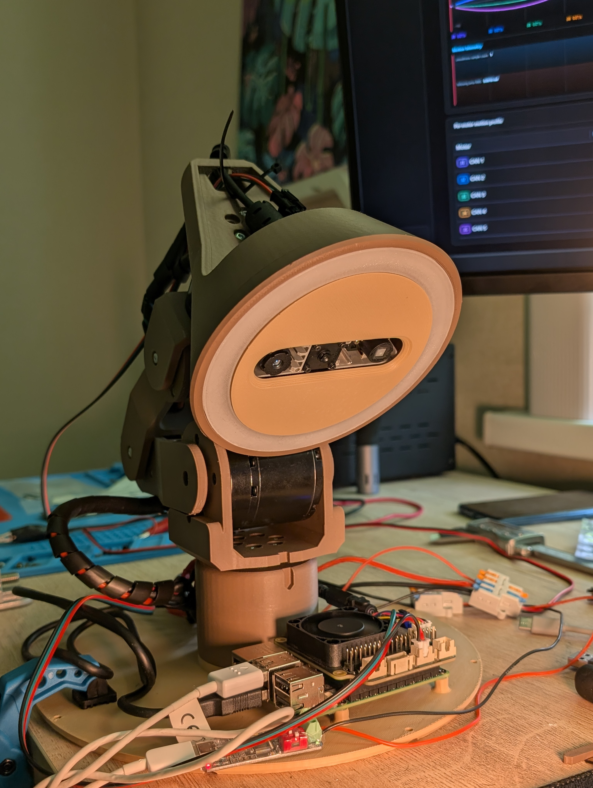
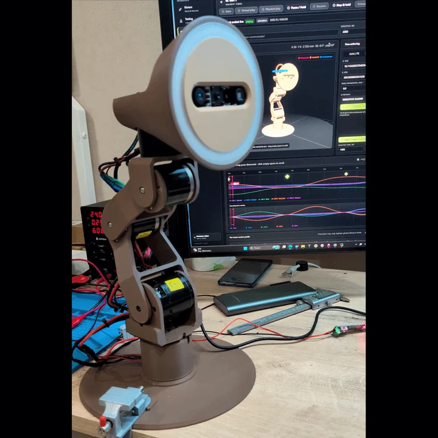
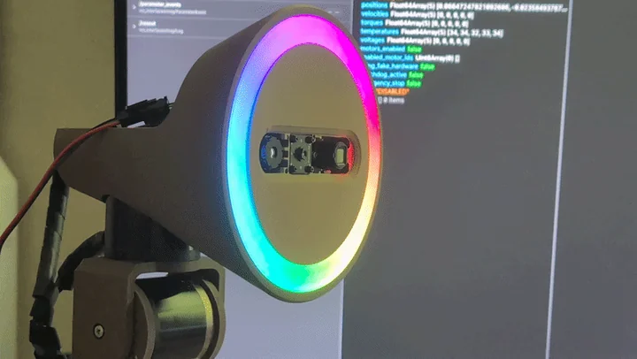
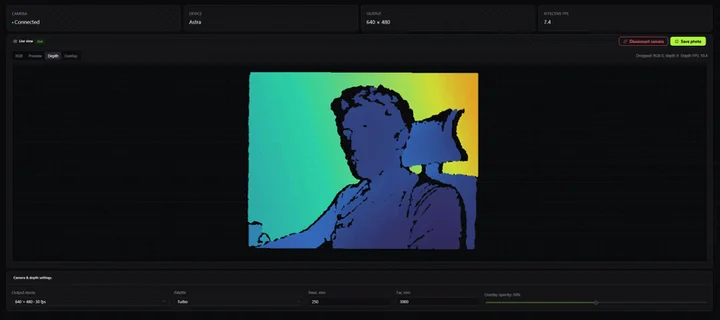

# Hardware

This is the hardware in the current Watti prototype. It is a snapshot of the build, not yet a shopping list or an assembly guide.

The current prototype cost around **$700** in parts. That is a rough estimate rather than a final bill of materials; the total will vary with component prices, shipping, and whatever the prototype decides to break next.

  

## Main parts

| Part | Current hardware |
| --- | --- |
| Computer | [Raspberry Pi 5](https://www.raspberrypi.com/products/raspberry-pi-5/) |
| Motion | 5 RobStride motors ([EL05](https://www.robstride.com/products/eduLite05), [00](https://www.robstride.com/products/robStride00)) |
| Light | 45 individually addressable WS2812 RGB LEDs |
| Camera | [Orbbec Astra Mini S RGB-D](https://www.orbbec.com/products/structured-light-camera/astra-mini-pro-series/) |
| Cooling and power | [Geekworm X735 V3](https://wiki.geekworm.com/X735) |

## Motion

Five axes give Watti roughly the same range of movement as a classic articulated desk lamp:

| Axis | What it moves |
| --- | --- |
| Base | Turns the lamp left and right |
| Shoulder | Tilts the lower arm |
| Elbow | Tilts the upper arm |
| Neck | Tilts the head |
| Head | Rotates the head |

The motors report their positions back to Watti. The editor uses that feedback to show the current pose and to play animations.

Physical movement is still being tested. Until it is ready for public testing, the same scenes can be built and played on the virtual model in Watti Studio.

  

## Light

There are 45 addressable WS2812 RGB LEDs in Watti's head. A scene can change their color, brightness, and effects alongside the motor poses, all on the same timeline.

  

## Depth camera

The Orbbec Astra Mini S captures RGB and depth at 640 × 480 and 30 FPS. Because the depth map is aligned with the color image, Watti can relate a pixel to a point in the space in front of it.

At the moment, the editor can display both streams. Hand tracking, work-area lighting, and 3D scanning are planned next.

  

## Power

The prototype uses an external 24 V, 10 A power supply. A Geekworm X735 V3.0 board steps that down to 5 V for the Raspberry Pi.
